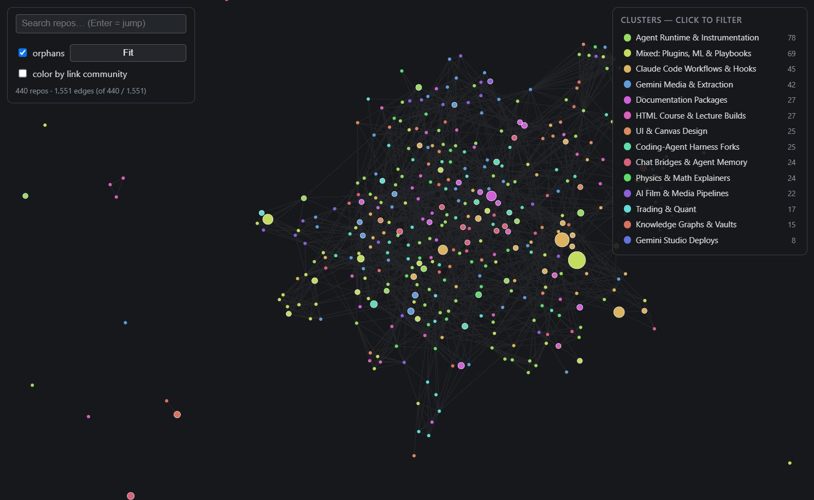

# graphify-my-repos

**A 448-repository GitHub portfolio, read end to end, clustered two different ways, and rendered as an interactive Obsidian-style physics graph.**

[](https://az9713.github.io/graphify-my-repos/graph.html)

<p align="center"><em>↑ click the image for the live, draggable graph</em></p>

## Live pages

| Page | What it is |
|---|---|
| **[graph.html](https://az9713.github.io/graphify-my-repos/graph.html)** | The interactive graph. Drag a node and its neighbours follow with a springy lag — links are springs, dragging re-heats the simulation. Search, cluster filters, star-sized nodes, two colour modes. |
| **[atlas.html](https://az9713.github.io/graphify-my-repos/atlas.html)** | The written report: 14 subject clusters with every member listed, reach chart, orphan list, hub/bridge table. |
| **[DEVELOPMENT_JOURNEY.html](https://az9713.github.io/graphify-my-repos/DEVELOPMENT_JOURNEY.html)** | How all of it got built, including the wrong turns — the full story. |
| **[portfolio-suggestions.html](https://az9713.github.io/graphify-my-repos/portfolio-suggestions.html)** | 16 project suggestions across two tracks. ⚠️ Contains two claims the data later disproved — kept deliberately; see below. |

## The finding

The interesting result is a **disagreement between two clusterings of the same corpus**.

- Cluster the READMEs by their **text** → 14 interpretable subject clusters (Trading & Quant, Physics & Math Explainers, AI Film & Media Pipelines, …).
- Cluster the repos by the **concepts extracted from them** → 11 communities built from shared tooling.

Laid out by physics, the subject clusters **do not separate in space**: only **15.7%** of connected repos sit nearest their own cluster's centroid, against 7.1% by chance. Recolour the identical layout by the link graph's own communities and it jumps to **35.0%** (chance ≈ 9%).

So the links carry real structure — it just isn't the topic structure. LLM concept extraction over technical prose surfaces *tools and vendors*, not *subjects*: of 544 extracted concepts, the top 40 by degree were all technologies, and 331 appeared in exactly one document. Both colourings ship, because the disagreement is the point. Toggle **"color by link community"** in the graph to see it.

Two more results that changed the advice in `portfolio-suggestions.html` after it was written:

- **Stars track subject, not originality.** Derivative repos average 0.68★, originals 0.54★ — indistinguishable. But six agent-tooling clusters hold 268 repos / 244 stars, while the six covering physics, trading, film, courses, knowledge graphs and deployed apps hold 113 repos / **11 stars**.
- **Only 15 of 448 repos have GitHub topics set** (37 have a homepage URL). The cheapest discoverability fix available, and it was missed by the original suggestions.

The suggestions page was left unedited so the correction is visible rather than erased.

## How it was built

```
GitHub API ──► corpus/           448 metadata records + 448 READMEs (truncated to 20k)
                  │
                  ├─► LLM concept extraction (18 subagents, 3,366,498 input tokens)
                  │        └─► graph.json      1,569 nodes / 2,868 edges / 544 concepts
                  │              └─► recluster.py   Newman-weighted repo↔repo projection
                  │                                 + Louvain sweep + betweenness
                  │
                  └─► topics2.py   TF-IDF → SVD(120) → KMeans(14)   (seconds, zero tokens)
                           │
                           ▼
                      merge.py ──► atlas-data.json ──► atlas.html
                                          │
                                          └──► build_graph.py ──► graph.html
```

**Projection rule** (identical in `recluster.py` and `build_graph.py` — change one, change both):

```
drop any concept appearing in >120 repos     # universal → no signal
weight each shared concept by 1/(k-1)        # Newman weighting, k = repos sharing it
prune edges with weight <= 0.02
then keep each repo's 6 strongest ties       # graph view only; the full 7,581-edge
                                             # set lays out as one featureless ball
```

**Stack:** Python standard library + scikit-learn + NetworkX for the pipeline; [force-graph](https://github.com/vasturiano/force-graph) (Canvas 2D + d3-force) vendored and inlined for the viewer. No npm, no bundler, no framework, no server — every deliverable is one double-clickable HTML file.

## Numbers

| Figure | Value | What it counts |
|---|---:|---|
| Repositories | 448 | Everything on the account |
| Present in the extracted graph | 440 | The rest produced no extractable content |
| Projection edges | 7,581 | Before per-node pruning |
| Edges drawn | 1,551 | After keeping each repo's 6 strongest ties |
| Orphans (atlas) | 72 | ≤1 neighbour in the unpruned projection |
| Orphans (graph view) | 57 | Zero edges after pruning — different question, different number |
| Zero-star repos | 363 | of 448 |
| Extraction cost | 3,366,498 | input tokens, one run |

## Rebuild

```bash
python recluster.py     # from inside graphify-out/ — writes atlas2.json
python topics2.py       # TF-IDF clustering            — writes topics.json
python merge.py         # joins everything             — writes atlas-data.json
python build_graph.py   # projection + injection       — writes graph.html
```

Needs `scikit-learn`, `numpy`, `networkx`. `topics.py` is the **broken** first attempt, kept on purpose — it clustered on README boilerplate instead of content. Don't run it; read it.

## Files

| File | Role |
|---|---|
| `build_graph.py`, `graph-template.html`, `force-graph.min.js` | Graph build: projection → pruning → single-file injection |
| `recluster.py` | Newman projection, Louvain resolution sweep, sampled betweenness |
| `topics2.py` / `topics.py` | Subject clustering (working / broken-on-purpose) |
| `merge.py` | Joins text clusters + graph metrics + API metadata |
| `atlas-template.html`, `atlas-data.json`, `topics.json` | Atlas page source and data |
| `az9713-corpus/` | 448 metadata records and 448 README documents |
| `graphify-out/` | Extracted graph, communities, per-repo centrality |
| `HANDOFF.md` | Session-to-session state note (this project has no git history before now) |

**`graph.html` and `atlas.html` are generated.** Edit the templates and rebuild; direct edits are overwritten.

## Gotchas worth stealing

- **A force graph in a hidden browser tab never runs.** Chrome throttles `requestAnimationFrame` to zero, so the page renders d3-force's *initial* phyllotaxis spiral — an even disc that looks like a real but structureless layout. Check `document.visibilityState` before believing a screenshot of anything animated.
- **A custom gravity force collapsed the whole graph to (0,0).** The library's built-in centering force already does the job, and disconnected nodes drift into a natural outer halo on their own.
- **One missing field blanked three sections of the atlas silently.** An exception inside a template literal abandons every DOM assignment after it, and the console showed nothing. Screenshot every section.
